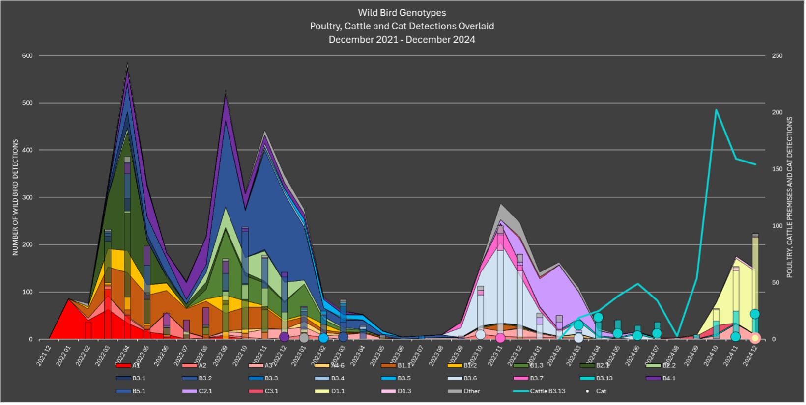
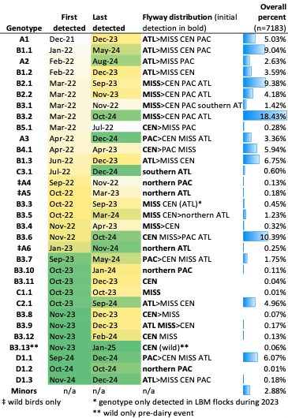

# GenoFLU-multi
Updated February 19, 2024

* Merged v1.06 from GenoFLU repo to include updated reference files

Updated December 18, 2024

* Added multiprocessing functionality, enabled with the `-m` or `-n` arguments

Updated November 1, 2024

* Added functionality to classify multiple strains at a time


## Installation
To use GenoFLU-multi, clone the Github repo as follows:

``
git clone https://github.com/moncla-lab/GenoFLU-multi
``


## Usage
Generate FASTA file(s) that contain all eight gene segments for each strain to be classified and put them into a single directory (`<FASTA_directory>`).

Segments can be combined into a single FASTA file or split among separate files (all `.fasta` files inside the directory will be parsed); however, FASTA headers for each entry should be identical for a given strain (see test-multi folder for examples––e.g., '>A/Cattle/Colorado/24-012225-023-original/2024' is present in each of the 8 FASTA files corresponding to individual segments).

To run GenoFLU-multi, first change directories:

``
cd GenoFLU-multi
``

And then call the python script:

``
python bin/genoflu-multi.py -f <FASTA_directory>
``

A concatenated .tsv file containing the GenoFLU results for all strains will be output within a new `results` folder inside `<FASTA_directory>`.


## Multiprocessing
If you are annotating a large dataset, it is recommended to enable multiprocessing to reduce execution times as runtimes decrease nearly proportionally to the number of CPU cores provided (i.e., if 10 cores are utilized, the runtime is about 1/10 of the runtime without multiprocessing). Multiprocessing can either be enabled with the `-m` flag or with the `-n` flag, depending on the number of cores you would like to utilize.

To use all available cores:

``
python bin/genoflu-multi.py -f <FASTA_directory> -m
``

To use a specific number of cores:

``
python bin/genoflu-multi.py -f <FASTA_directory> -n <n_cores>
``

## Test
A small test dataset is available within the `test-multi` directory. To run the test dataset through GenoFLU, use the following commands:

``
cd GenoFLU-multi
``

``
python bin/genoflu-multi.py -f test-multi
``


# GenoFLU

Updated January 2025

## Background

The GenoFLU tool was developed to classify HPAI H5N1 goose/Guangdong clade 2.3.4.4b viruses detected in North American flyways. This tool considers all eight gene segments and can classify clade 2.3.4.4b viruses that have reassorted with North American low pathogenic viruses. The GenoFLU tool was developed for North America utilizing references detected primarily within the United States. The A1 GenoFLU genotype corresponds to the European National Reference Laboratory (EURL) genotype ‘C’, which is Eurasian wigeon/Netherlands-like virus that was predominant at the time the A1 virus was initially identified in Newfoundland. Additionally, GenoFLU genotypes A2, A3, and A5 are also EURL genotype ‘C’; A6 is EURL genotype ‘I’; only the A4, introduced in the northern Pacific flyway, is distinct and does not have a corollary in the EURL system (meaning has not been seen in Europe).

Using GenoFLU, fully Eurasian and distinct introductions of H5 2.3.4.4b virus are denoted by “A” with serial numbering. Genotype A1 Eurasian viruses that have re-assorted with North American low pathogenic viruses by their initial introduction are denoted by “B”, re-assortments of the A2 virus introduction are denoted by “C”, and reassortants of the A3 introduction are denoted by “D.” To date, other Eurasian introductions into the U.S. (A4, A5 and A6 genotypes) have not been observed to reassort with North American viruses. The GenoFLU system also ensures that viruses sharing a common lineage can be classified. For example, B3 genotypes include 13 distinct reassortants denoted B3.1 to B3.13 and each share a common HA/NA phylogeny in addition to shared North American segments. Minor genotypes are assigned serially (and not reused) as novel constellations are identified and may be reassigned with a formal genotype where specified criteria are met. Named genotypes are assigned as they meet the criteria of at least 20 wild bird detections, and/or infection of two or more poultry premises. Unusual events such as an atypical host species may also prompt establishment of a named genotype.

# Using GenoFLU

The GenoFLU tool is intended to identify the genotype of North American H5 2.3.4.4b viruses as well as providing information on individual segments when a sequence does not belong to a defined genotype. Input for the tool should be high quality, high coverage sequences with all eight segments present. The number of mixed bases should be low as mixed sequences may result in aberrant genotype calls. Both FASTQ and FASTA sequence data can be input into the tool; however, FASTA file input will not generate statistics on the average depth of coverage and care should be taken to utilize high quality consensus sequences.

Within the [genotyping scheme](./docs/Genotyping_reference_for_US_H5_2.3.4.4b.pdf), each segment has a set of reference “type” sequences for the segment, each assigned a unique number. Sequences that fall within 2% identity of the reference are called as that segment number. Each genotype is defined by the constellation of segment numbers.

## Installation

```
conda create -c conda-forge -c bioconda -n genoflu genoflu
```

## Usage

FASTA file containing a single segmented influenza genome, with each segment having its own individually named header.

```
genoflu.py -f <*.fasta>
```

## Test

Test genome available at test/test-genome-A1.fasta

```
genoflu.py -f test-genome-A1.fasta
```

test-genome-A1 Genotype --> A1: PB2:ea1, PB1:ea1, PA:ea1, HA:ea1, NP:ea1, NA:ea1, MP:ea1, NS:ea1

## Output

Genotype summary as Excel and tab delimited text file. There are six columns of output data from GenoFLU:

-   <u>**Genotype**</u>: Provides the genotype when the sequence matches at the full constellation of 8 segments associated with an established major or minor genotype. When a match to an established genotype is not available, the field provides relevant information: noting that the genotype was “Not Assigned” and either listing the number of segments found (partial sequence); the number of segments with >98% match, indicating there are segments with a novel gene; or if all segments match an established segment number but no established genotype exists, “No Matching Genotypes.”

-   <u>**Genotype List Used, >=98%**</u>: Provides the list of segments that correspond to an existing established segment with a match of 98% or greater. This field can be used to identify the constellation of the genotype, or to identify which segments may represent new or novel re-assortments.

-   <u>**Genotype Sample Title List**</u>: Provides the top matched reference for each segment.

-   <u>**Genotype Percent Match List**</u>: Provides the percentage match to the top match for each segment. This field follows the same order as the Genotype Sample Title list.

-   <u>**Genotype Mismatch List**</u>: Provides the number of mismatches between the sample and the top match for each segment.

-   <u>**Genotype Average Depth of Coverage List**</u>: Provides the average depth of coverage for each segment.

## Utility of partial genotype matches

For samples where genotype is not assigned, partial genotype matches can provide information on the origin of individual virus segments. The “genotype list used” will provide the mapped segments. The sample title list and percent match list will provide information on whether a new segment number would be assigned. If the results in these fields suggest that a new genotype should be assigned on a high-quality sequence of North American origin, please contact NVSL at NVSL.AI.ND@usda.gov for more information.

## Distribution of GenoFLU genotypes

Genotype A1 (fully Eurasian [EA]) was first identified in Newfoundland in November 2021 and subsequently wild birds in the Atlantic Flyway collected December 2021. A1 became the predominant unreassorted genotype across all four flyways during 2022, and reassortants of A1 with North American (AM) low pathogenic avian influenza viruses created the ‘B’ genotypes that subsequently predominated during this event. Spillover events into poultry have occurred for all major genotypes except A4, A5, and A6.

The first ‘B’ reassortant genotype was collected in late January 2022, and detection of several other reassortant genotypes have followed, continuing into 2024. The B3.2 genotype is a four gene EA/AM reassortant first detected from samples collected in March 2022 and is the most frequently detected genotype to date in the Americas. By fall of 2022, this genotype had disseminated along flyways into Central and South America, with detections as far south as Antarctica.

Other fully Eurasian genotypes were also introduced into the Atlantic flyway (A2, A5, A6) and the Pacific flyway (A3, A4). Poultry have been affected by genotypes A1, A2, and A3. The A2 genotype was first detected in February 2022 in the northeastern US and persisted in the Atlantic flyway for much of 2022 and early 2023. This genotype was associated with sea bird and marine mammal mortality events in northeastern US. The genotype spread to the Mississippi flyway by the fall of 2023 and re-assorted with North American (AM) wild bird avian influenza viruses including a neuraminidase re-assortment (H5N6), giving rise to the GenoFLU “C” and other minor genotypes. Note: because A2 shows high genetic similarity to the A1 genotype in several segments, only the HA, NA, and PB1 genes have designated references for the A2 genotype in the GenoFLU tool.

Genotype B3.13 likely emerged sometime in the fall of 2023 with only four detections in wild species prior to the detections in cattle (one goose in Colorado, one goose in Wyoming, one raptor in California, and one skunk in

New Mexico). The earliest of these was November 2023 in the Central flyway (Colorado). In late March 2024, genotype B3.13 was identified in the milk of dairy cattle; the spillover event from avian species to cattle is estimated to have occurred sometime between late 2023 to early 2024. After the detection of B3.13 in dairy cattle, secondary spread among dairy farms continues, and virus from the dairies has affected peridomestic wildlife, domestic cats, and domestic poultry. Genotype B3.13 is shown in Figure 1, and only the early wild representatives shown in Table 1; the dairy event with spillover to poultry has not been associated with migratory wild birds

New reassortants of GenoFLU A3 predominated the late fall/winter of 2024 denoted as “D” genotypes in Figure 1 and Table 1. Genotype D1.1 has been identified most frequently and across all four flyways, following recent the trajectory of A3 which had previously been limited to the Pacific flyway. The D1.1 genotype has affected poultry and spilled over into mammals.

**Figure 1.** Genotype distribution of wild bird detections from December 2021 to 7 January 2025 in wild birds with poultry, and B3.13 detections in dairy, overlaid. The dots represent genotypes detected in domestic cats.

<br>
<br>
<br>

**Table 1.** Migratory bird GenoFLU genotypes by overall percent, dates of detection, and flyway distribution as of 7 January 2025. Includes detections in wild migratory birds, poultry species and non-dairy mammals; only one sequence per poultry premises was included to represent the premises. <b>NOTE:</b> This table includes only the early representatives of genotype B3.13 first detected in the Central and Pacific flyways <u>prior</u> to the dairy/poultry events.

