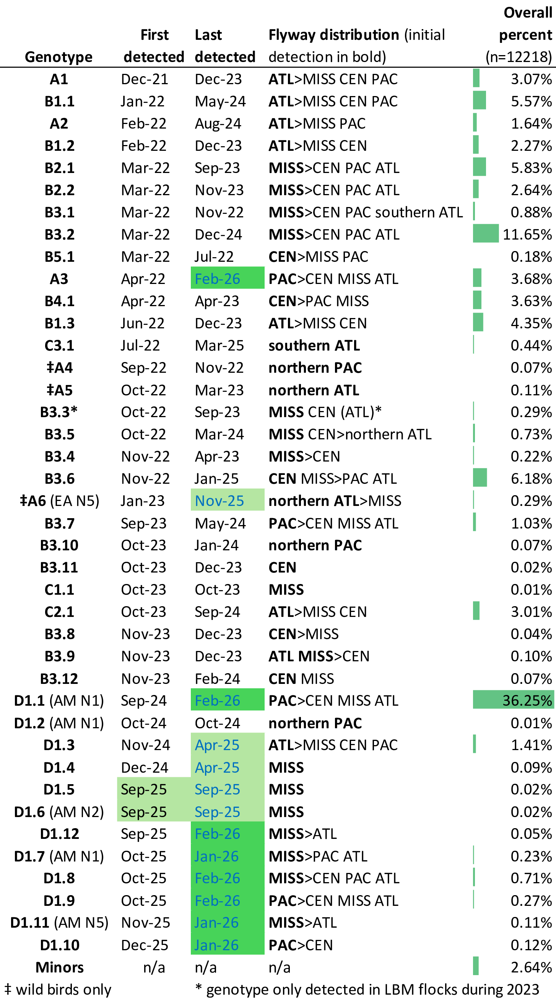

# GenoFLU-multi
Updated March 10, 2026

* Merged v1.07
* Fixed a minor bug that could lead to an error if multiprocessing was enabled and a blank results.tsv file already existed
* Added functionality to automatically re-run strains that were previously annotated as a genotype that no longer exists (i.e., a minor genotype that was re-designated as a major genotype) or that had no matching genotypes

Updated March 5, 2025

* Added the ability to annotate strains that do not have sequences for all 8 segments, enabled with the `-i` flag

Updated February 19, 2025

* Merged v1.06 from GenoFLU repo to include updated reference files

Updated December 18, 2024

* Added multiprocessing functionality, enabled with the `-m` flag or `-n` argument

Updated November 1, 2024

* Added functionality to classify multiple strains at a time


## Installation
To use GenoFLU-multi, clone the Github repo as follows:

``
git clone https://github.com/moncla-lab/GenoFLU-multi
``


## Usage
Generate FASTA file(s) that contain all eight gene segments for each strain to be classified and put them into a single directory (`<FASTA_directory>`).

Segments can be combined into a single FASTA file or split among separate files (all `.fasta` files inside the directory will be parsed); however, FASTA headers for each entry should be identical for a given strain (see test-multi folder for examples––e.g., '>A/Cattle/Colorado/24-012225-023-original/2024' is present in each of the 8 FASTA files corresponding to individual segments).

To run GenoFLU-multi, first change directories:

``
cd GenoFLU-multi
``

And then call the python script:

``
python bin/genoflu-multi.py -f <FASTA_directory>
``

A concatenated .tsv file containing the GenoFLU results for all strains will be output within a new `results` folder inside `<FASTA_directory>`.


## Multiprocessing
If you are annotating a large dataset, it is recommended to enable multiprocessing to reduce execution times as runtimes decrease nearly proportionally to the number of CPU cores provided (i.e., if 10 cores are utilized, the runtime is about 1/10 of the runtime without multiprocessing). Multiprocessing can either be enabled with the `-m` flag or with the `-n` flag, depending on the number of cores you would like to utilize.

To use all available cores:

``
python bin/genoflu-multi.py -f <FASTA_directory> -m
``

To use a specific number of cores:

``
python bin/genoflu-multi.py -f <FASTA_directory> -n <n_cores>
``

## Test
A small test dataset is available within the `test-multi` directory. To run the test dataset through GenoFLU, use the following commands:

``
cd GenoFLU-multi
``

``
python bin/genoflu-multi.py -f test-multi
``


# GenoFLU classification for H5N1 HPAI 2.3.4.4b viruses in North American flyways

[](https://github.com/USDA-VS/GenoFLU)
[]()
[](https://anaconda.org/bioconda/genoflu)
[]()
[](https://pubmed.ncbi.nlm.nih.gov/37572517/)
[]()

**GenoFlu** tool was developed to classify HPAI H5N1 goose/Guangdong clade 2.3.4.4b viruses detected in North American flyways. This tool considers all eight gene segments and can classify clade 2.3.4.4b viruses that have reassorted with North American low pathogenic viruses. The GenoFlu tool was developed for North America utilizing references detected primarily within the United States. The A1 GenoFlu genotype corresponds to the European National Reference Laboratory (EURL) genotype “EA-2020-C”, which is Eurasian wigeon/Netherlands-like virus that was predominant at the time the A1 virus was initially identified in Newfoundland.  Additionally, GenoFlu genotypes A2, A3, and A5 are also EURL GenIn2 genotype “EA-2020-C”’; A6 is GenIn2 genotype “EA-2021-I”; only the A4, introduced in the northern Pacific flyway, is distinct and does not have a corollary in the GenIn2 system (meaning has not been seen in Europe). 

Using GenoFlu, fully Eurasian and distinct introductions of H5 2.3.4.4b virus are denoted by the letter “A” followed by serial numbering. Genotype A1 Eurasian viruses that have re-assorted with North American low pathogenic viruses by their initial introduction are denoted by “B”, re-assortments of the A2 virus introduction are denoted by “C”, and reassortants of the A3 introduction are denoted by “D.” To date, other Eurasian introductions into the U.S. (A4, A5 and A6 genotypes) have not been observed to reassort with North American viruses. The GenoFlu system also ensures that viruses sharing a common lineage can be classified. For example, B3 genotypes include 13 distinct reassortants denoted B3.1 to B3.14 and each share a common HA/NA phylogeny in addition to shared North American segments. Minor genotypes are assigned in serial (and numbers are not reused) as novel constellations are identified and may be reassigned with a formal genotype where specified criteria are met. Named genotypes are assigned as they meet the criteria of at least 20 wild bird detections, and/or infection of two or more poultry premises. Unusual events such as an atypical host species may also prompt establishment of a named genotype.  

<p align="center">
  
</p>
<p align="center"><b>Figure 1.</b> Genotype distribution of wild bird (top), dairy cattle (middle), and poultry detections (bottom), represented as moving quarterly averages normalized to detections in each animal category, as of 1 February 2026. </p>

## 🌟 Why Use GenoFLU?

- **Comprehensive Genotyping**: Analyzes all eight gene segments for accurate classification
- **High Precision Matching**: Uses a 98% identity threshold to classify segments against reference types
- **Reassortment Detection**: Identifies reassortment events between Eurasian and North American viruses
- **Lineage Tracking**: Maintains genealogical relationships between different genotypes
- **Input**: Accepts FASTA sequence data
- **Transparent Results**: Provides detailed match statistics for each segment
- **Real-time Surveillance**: Supports ongoing monitoring of emerging genotypes
- **Host Species Analysis**: Tracks virus spread across avian and mammalian hosts
- **Comprehensive Output**: Generates both Excel and tab-delimited outputs for easy integration into workflows

## 🔍 Understanding GenoFLU Genotyping

### The GenoFLU Classification System

GenoFLU uses a systematic approach to classify H5N1 viruses:

- **A-type genotypes**: Fully Eurasian viruses, each representing a distinct introduction (A1, A2, etc.)
- **B-type genotypes**: Reassortants of the A1 introduction with North American viruses
- **C-type genotypes**: Reassortants of the A2 introduction with North American viruses
- **D-type genotypes**: Reassortants of the A3 introduction with North American viruses

This system ensures that viruses sharing a common lineage can be logically classified (e.g., B3 genotypes include 13 distinct reassortants, B3.1 to B3.13).

<p align="center">
  
</p>
<b>Table 1:</b>  H5 clade 2.3.4.4b GenoFlu genotypes by overall percent, dates of detection, and flyway distribution as of 1 February 2026 (<i>does not include dairy events for B3.13 and D1.1</i>). Includes detections in wild migratory birds, poultry species and non-dairy mammals; only one sequence per poultry premises was included to represent the premises. Genotypes are Eurasian H5 and N1 unless otherwise noted.  Genotypes identified in 2025-26 are highlighted GREEN. NOTE: <i>The dairy cattle event genotypes B3.13 and D1.1 are not represented as these events are not mediated by virus from wild migratory waterfowl</i>.     

## Distribution of GenoFlu genotypes in the U.S. (refer to Table 1 for major genotypes)

Genotype A1 (fully Eurasian [EA]) was first identified in Newfoundland in November 2021 and subsequently wild birds in the Atlantic flyway collected December 2021. A1 became the predominant unreassorted genotype across all four flyways during 2022, and reassortants of A1 with North American (AM) low pathogenic avian influenza viruses created the ”B” genotypes that subsequently predominated during this event. Spillover events into poultry have occurred for all major genotypes except A4 and A5. 

The first “B” reassortant genotype was collected in late January 2022, and detection of several other reassortant genotypes followed, which declined significantly in early 2024 in the U.S. The B3.2 genotype is a four gene EA/AM reassortant first detected from samples collected in March 2022 and continues to be the most frequently detected genotype to date in the Americas. By fall of 2022, genotype B3.2 had disseminated along flyways into Central and South America, with detections as far south as Antarctica. While there continue to be some detections outside the U.S., Genotype B3.2 was last detected in the U.S. in late December 2024. The B3 genotypes appear to have largely died out in the U.S. with the exception of B3.13 in dairy cattle. 

Genotype B3.13 likely emerged sometime in the fall of 2023 with only four detections in wild species prior to the detections in cattle (one goose in Colorado, one goose in Wyoming, one raptor in California, and one skunk in New Mexico). The earliest of these was November 2023 from the Central flyway (Colorado). In late March 2024, genotype B3.13 was identified in the milk of dairy cattle; the spillover event from avian species to cattle is estimated to have occurred sometime between late 2023 to early 2024. After the detection of B3.13 in dairy cattle, secondary spread among dairy farms continues, and virus from the dairies has affected peridomestic wildlife, domestic cats, and domestic poultry. Genotype B3.13 is shown in Figure 1, and only the early wild representatives shown in Table 1; the dairy event with spillover to poultry has not been associated with migratory wild birds. 

Other fully Eurasian genotypes were also introduced into the Atlantic flyway (A2, A5, A6) and the Pacific flyway (A3, A4). Poultry have been affected by genotypes A1, A2, and A3, with a single backyard in the northern Pacific flyway affected by A6(H5N5). The A2 genotype was first detected in February 2022 in the northeastern U.S. and persisted in the Atlantic flyway for much of 2022, with the last detection in fall of 2024. This genotype was associated with sea bird and marine mammal mortality events in the northeastern U.S. The A2 genotype spread to the Mississippi flyway by the fall of 2023 and re-assorted with North American (AM) wild bird avian influenza viruses, including a neuraminidase reassortment (H5N6), giving rise to the GenoFlu “C” and other minor genotypes. Note: because A2 shows high genetic similarity to the A1 genotype in several segments, only the HA, NA, and PB1 genes have designated references for the A2 genotype in the GenoFlu tool. The “C” genotypes (see Table 1) were observed from October 2023, with the last detection being C3.1 in March 2025 along the south Atlantic flyway. 

The current “D” genotypes represent reassortants of GenoFlu A3 that emerged in the late fall/winter of 2024 (Figure 1 and Table 1). Genotype D1.1, a four gene reassortant of A3 with North American genes, including N1, replaced previous B3 genotypes by late 2024 and is currently the most frequently detected genotype since the start of this event. Circulation of genotype A3 remained limited to the Pacific flyway until late fall and winter of 2024, when A3 and the “D” genotypes expanded eastward, affecting wild birds, poultry, and wild mammals across all four migratory flyways. The D1.1 genotype has affected poultry, spilled over into mammals, and affected a small number of dairy cattle herds in three different states (AZ, NV, WI), and continues to evolve with new genotypes (D1.5, D1.6 [AM N2], D1.11 [AM N5]) identified to date. 

## Using GenoFlu:

The GenoFlu tool is intended to identify the genotype of North American H5 2.3.4.4b viruses as well as providing information on individual segments when a sequence does not belong to a defined genotype. Input for the tool should be high quality, high coverage sequences with all eight segments present. The number of mixed bases should be low as mixed sequences may result in aberrant genotype calls. Both FASTQ and FASTA sequence data can be input into the tool; however, FASTA file input will not generate statistics on the average depth of coverage and care should be taken to utilize high quality consensus sequences.

Within the genotyping scheme, each segment has a set of reference “type” sequences for the segment, each assigned a unique number. Sequences that fall within ~2% identity of the reference are called as that segment number. Each genotype is defined by the constellation of segment numbers. There are six columns of output data from GenoFlu.

### Tracking Avian Influenza Evolution and Spread

GenoFLU has been instrumental in tracking the evolution and spread of H5N1 in North America:

- **December 2021**: First detection of A1 (fully Eurasian) in Newfoundland
- **January 2022**: First detection of reassortant B-type genotypes
- **2022-2024**: Tracking of multiple introductions and reassortment events across all flyways
- **Late 2023-2024**: Identification of B3.13 genotype in dairy cattle, representing a significant host jump
- **Late 2024**: Emergence of D-type genotypes across all four flyways

### Supporting Outbreak Response

GenoFLU enables rapid classification of outbreak isolates, helping to:
- Identify the source of new outbreaks
- Track virus spread between locations
- Monitor reassortment events that may change virus properties
- Guide targeted surveillance strategies

### 🧪 How GenoFLU Works

GenoFLU uses BLAST to compare each segment of your influenza genome against a curated database of reference sequences. Here's how the process works:

1. **Database Creation**: The tool builds a BLAST database from reference sequences where each segment has a specific genotype identifier
2. **Sequence Alignment**: Your input FASTA is aligned against this database using BLAST
3. **Segment Classification**: Each segment is assigned to a reference "type" if it shows ≥98% identity (configurable with `-p` flag)
4. **Genotype Matching**: The genotyping scheme of segment types is compared against a [reference table](./docs/Genotyping_reference_for_US_H5_2.3.4.4b.pdf) of known genotypes
5. **Result Generation**: The tool outputs the genotype if all segments match a known genotyping scheme, or provides detailed information about which segments matched/didn't match

Within the genotyping scheme, each segment has reference "type" sequences assigned unique numbers. A complete genotype is defined by its unique genotyping scheme of all eight segment numbers.

## 📦 Installation

```bash
# Create a conda environment with GenoFLU
conda create -c conda-forge -c bioconda -n genoflu genoflu

# Activate the environment
conda activate genoflu
```

## 🚀 Quick Start

```bash
# Basic usage with a FASTA file
genoflu.py -f <your_genome.fasta>

# Try the test genome
genoflu.py -f test/test-genome-A1.fasta
# Expected output: test-genome-A1 Genotype --> A1: PB2:ea1, PB1:ea1, PA:ea1, HA:ea1, NP:ea1, NA:ea1, MP:ea1, NS:ea1
```

## 📊 Understanding GenoFLU Output

GenoFLU provides comprehensive output in both Excel and tab-delimited formats with six key columns:

- **Genotype**: provides the genotype name when the sequence matches at the full constellation of 8 segments associated with an established major or minor genotype. When a match to an established genotype is not available, the field provides relevant information: noting that the genotype was “Not Assigned” and either listing the number of segments found (partial sequence); the number of segments with >98% match, indicating there are segments with a novel gene; or if all segments match an established segment number but no established genotype exists, “No Matching Genotypes.”

- **Genotype List Used, >=98%**: provides the list of segments that correspond to an existing established segment with a match of 98% or greater. This field can be used to identify the constellation of the genotype, or to identify which segments may represent new or novel re-assortments.

- **Genotype Sample Title List**: provides the top matched reference for each segment.

- **Genotype Percent Match List**: provides the percentage match to the top match for each segment. This field follows the same order as the Genotype Sample Title list.

- **Genotype Mismatch List**: provides the number of mismatches between the sample and the top match for each segment. 

- **Genotype Average Depth of Coverage List**: provides the average depth of coverage for each segment.

## Utility of partial genotype matches:

For samples where a genotype is not assigned, partial genotype matches can provide information on the origin of individual virus segments. The “genotype list used” will provide the mapped segments. The “genotype sample title list” and “genotype percent match list” will provide information on whether a new segment number would be assigned. If the results in these fields suggest that a new genotype should be assigned on a high-quality sequence of North American origin, please contact NVSL at NVSL.AI.ND@usda.gov for more information.

## 🧬 How GenoFLU Works Internally

GenoFLU processes your input sequences through several key steps:

### 1. Reference Database Creation
The tool creates a BLAST database from the reference sequences located in the dependencies directory:
```bash
cat ${HOME}/git/gitlab/genoflu/dependencies/fastas/*.fasta | makeblastdb -dbtype nucl -out hpai_geno_db
```

### 2. Sequence Alignment and Segment Typing
Your input FASTA is aligned against this database using BLASTN:
```bash
blastn -query input.fasta -db hpai_geno_db -word_size 11 -outfmt "6 qseqid qseq length nident pident mismatch evalue bitscore sacc stitle" -num_alignments 1
```

The tool captures key alignment statistics for each segment:
- Length of alignment
- Number of identical bases
- Percent identity
- Number of mismatches
- E-value and bit score
- Reference segment information

### 3. Genotype Determination
GenoFLU compares the genotyping scheme of segment types against a reference table (genotype_key.xlsx):
- Each segment must match a reference at ≥98% identity (configurable)
- All 8 segments must match a known genotyping scheme for a genotype to be assigned
- If the genotyping scheme is novel, "No Match" is reported

### 4. Result Generation
Results are saved in both Excel (.xlsx) and tab-delimited (.tsv) formats with comprehensive match details for each segment.

## 🧩 Reference Database Structure

GenoFLU relies on a carefully structured reference database:

### FASTA Reference Files
Reference FASTA files must follow a specific header format for the tool to work correctly:
```
>genotype sample gene
```
For example:
```
>ea1 A/goose/Guangdong/1/96 PB2
ATGGAGAGAATAAAAGAACTAAGAGATCTAATGTCGCAGTCTCGCACTCGCGAGATACTGACAAAAACCACAGTGGAC...
```

Where:
- `ea1` is the segment genotype identifier
- `A/goose/Guangdong/1/96` is the sample name
- `PB2` is the gene segment

### Genotype Key File
The [genotype key Excel file](./docs/Genotyping_reference_for_US_H5_2.3.4.4b.pdf) defines known genotypes and their segment genotyping schemes:
- First column: Genotype name (e.g., "A1", "B3.2")
- Subsequent columns: Segment type for each of the 8 segments (PB2, PB1, PA, HA, NP, NA, MP, NS)

For example:
```
Genotype | PB2  | PB1  | PA   | HA   | NP   | NA   | MP   | NS
---------|------|------|------|------|------|------|------|------
A1       | ea1  | ea1  | ea1  | ea1  | ea1  | ea1  | ea1  | ea1
B3.2     | ea1  | am2  | ea1  | ea1  | ea1  | ea1  | am5  | am3
```

This structure allows GenoFLU to accurately match segment genotyping schemes to known genotypes.

## 🤝 Support and Citation

For support, please open an [issue on GitHub](https://github.com/USDA-VS/GenoFLU/issues) or [email directly](mailto:tod.p.stuber@usda.gov).

If you use GenoFLU in your research, please [cite our article](https://pubmed.ncbi.nlm.nih.gov/37572517/).
